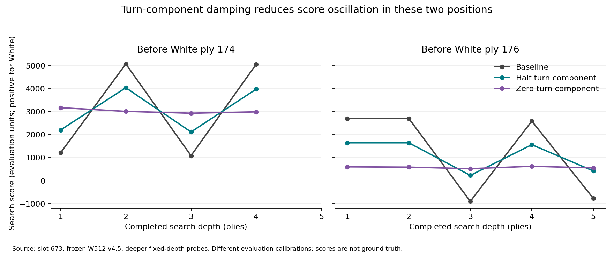

# Slot 673: controlled NNUE/search experiments

## Scope and interpretation

These are experiments on the positions before White's game plies 174 and 176,
using the original W512 v4.5 checkpoint and complete game prefixes. They are
not an Elo test. The initial desired behaviors were to preserve the threatened
Tengu at 174 and prefer taking the Crown Prince to the pawn-capture promotion at
176. A different move is not automatically wrong: the independent teacher finds
a credible delayed Crown Prince capture.

The engine is based on `66d47bec09a52ac1c969ebfb0664ae19cf6dfce2`. Experimental
source is committed separately from this report. Production `analyze_position`,
the GUI, checkpoints, and the live tournament were not modified or restarted.
Controls require the `search-experiments` feature and explicit opt-in. The
standalone `tactical_probe` uses one process per configuration.

The recorded dataset contains **457 searches across 38 phases**, including a
24-setting initial screen, combinations, repeated fixed-depth and three-second
tests, deeper follow-ups, and independent candidate comparisons. Every process
exited successfully; a successful exit can still mean the requested depth was
not completed before its search deadline. Two additional final-build baseline
checks are recorded separately in `verification.json`.

The baseline exactly reproduces the saved game choices, scores, and nodes:

| Position | Completed depth | Move (zero-based engine coordinates) | Black score | Nodes |
|---|---:|---|---:|---:|
| Before 174 | 3 | Woodland Demon `17,31-17,1+` | -1089 | 576,814 |
| Before 176 | 4 | Dragon King `26,26-26,10+` | -2592 | 1,309,672 |

Negative scores favor White. Scores from different evaluator variants are not
interchangeable evidence of position quality.

## What changed the decisions

The most useful diagnostic intervention is reducing the learned
same-board turn component. Let `r(s)` be NNUE's residual for the player to move
and `r(o)` its residual for the other player on the same board. We separate:

```
positional residual = (r(s) - r(o)) / 2
turn component      = (r(s) + r(o)) / 2
new residual        = positional residual + gamma * turn component
```

`gamma=1` is the original evaluation; `gamma=0.5` retains half the component;
`gamma=0` averages the two absolute board evaluations. Material, terminal wins,
and draws retain their original handling. Integer arithmetic preserves the
baseline exactly at 100%. Below 100%, another network output evaluation is
required. This is a diagnostic calibration change, not retraining and not a
claim that real initiative is half as valuable.

At the original depths, both global half-tempo and q-only half-tempo choose
`18,13-8,23-2,17` (move the Tengu) at 174 and `17,1-18,0` (take the Crown Prince)
at 176. Retaining 75% changes only the second choice. Removing all tempo also
moves the Tengu at depth 3; at 176 it takes the Crown Prince at depth 3 and
chooses Phoenix Master at depth 4. The latter agrees with the independent
teacher's deeper choice and cannot reasonably be scored as a tactical failure
merely because it delays the capture. Zero-tempo therefore received a follow-up
timed/deeper sweep; that extension was selected after the original results.

Three shuffled strict-depth repetitions gave these results:

| Setting | 174 move | 174 median search | 174 nodes | 176 move | 176 median search | 176 nodes |
|---|---|---:|---:|---|---:|---:|
| Baseline | Old Peng promotion | 2.370 s | 576,814 | Pawn promotion | 5.925 s | 1,309,672 |
| Global half-tempo | Tengu move | 1.616 s | 311,265 | Crown Prince | 2.761 s | 338,356 |
| Q-only half-tempo | Tengu move | 1.753 s | 311,265 | Crown Prince | 3.125 s | 387,966 |
| Context-aware q TT | Old Peng promotion | 2.827 s | 617,340 | Pawn promotion | 5.780 s | 1,323,778 |
| Force a q continuation after major landing | Capture Ox | 10.471 s | 1,842,668 | Incomplete depth 4 in all three 20 s runs | — | — |

Nodes and chosen routes were deterministic for completed repetitions. Timing
varied substantially on this laptop, so medians should not be read as precise
speedup predictions. The half-tempo node reductions are 46.0% and 74.2% in the
two target searches; they result from a changed search tree, not faster NNUE
inference. The ten independent control positions are essential context for
judging whether those savings generalize.

## The original preferences were small

Independent single-root searches compare full routes without interpreting
root PVS bounds as exact alternative scores. They produce these local
preferences at the original depths:

| Position | Evaluation | Original move score, Black | Alternative score, Black | Preference for White |
|---|---|---:|---:|---|
| 174 | Baseline | Old Peng -1089 | Tengu retreat -1086 | Old Peng by 3 |
| 174 | Half-tempo | Old Peng -1649 | Tengu retreat -2120 | Tengu by 471 |
| 176 | Baseline | Pawn promotion -2592 | Crown Prince -2550 | Pawn promotion by 42 |
| 176 | Half-tempo | Pawn promotion -1502 | Crown Prince -1567 | Crown Prince by 65 |

These are separate selective searches, not exact minimax proofs. Restricting the
root changes root ordering, reductions, and table history. Nevertheless, they
show why merely flipping the final move is a weak acceptance criterion: the
original competing choices can be separated by only a few evaluation units.

Black's reply at 175 exposes a larger discrepancy. Independent depth-2 searches
give the baseline Gold capture of Old Peng `16,0-17,1` a score of -1089 and
the Ox capture of the Tengu `21,10-18,13` -2707. Black therefore prefers the
Gold capture by **1618**. Half-tempo gives those routes -2094 and -1649,
respectively, preferring the Tengu capture by **445**. The continuation also
changes, so this is not a claim that a single fixed leaf accounts for the
entire difference. It does connect the intervention to a concrete defensive
resource the original search valued poorly, rather than only to a changed
White root move.

## Additional depth and independent teacher

At 174, an extra ordinary depth already helps: baseline depth 4 captures the Ox
with `22,10-21,10`, score -5064; half-tempo depth 4 selects the same capture,
score -3982. Half-tempo therefore finds a Tengu-preserving choice earlier;
the baseline is not incapable of discovering it.

At 176, baseline depth 5 selects `7,25-7,24`, score +765. Half-tempo depth 5
still takes the Crown Prince, score -427. Both searches took roughly a minute.
This supports stability of the half-tempo move at another depth, not a speed
advantage at every depth. Significant score oscillation remains.

Zero-tempo finishes 174 depth 4 in 2.698 s of search, capturing the Ox with
promotion, score -2993. At 176 it finishes depth 5 in 7.833 s, choosing Phoenix
Master `18,32-2,16`, score -558. This is a much cheaper search on these targets,
but the evaluator and explored tree both changed; it is not a mechanical
speedup and the control results below temper this apparent success.



SEEDS2 was reconstructed locally using the repository's pinned historical
recipe, with its checkpoint retained in `teachers/SEEDS2.json`. It uses the same
current search implementation, not a historical executable and not an oracle.

- At 174, SEEDS2's independent depth-3 scores are +2813 after the Old Peng
  promotion, +181 after the Tengu retreat, and +115/+118 after promoted/unpromoted
  Ox captures. Depth 4 gives +2825, +58, and +11/+13 respectively. This is strong
  agreement that ignoring the Tengu threat is bad. Its full-root depth-4 choice
  is the Tengu capturing the Ox, `18,13-21,10-24,13`, score +6.
- At 176, it prefers the immediate Crown Prince capture to the pawn promotion
  by 100 at depth 4 and 36 at depth 5. However, its full-root depth-5 choice is
  Phoenix Master `18,32-2,16`, followed in the traced continuation by the Crown
  Prince capture. Thus immediate capture is a useful comparison target, not the
  only acceptable tactical continuation.

## Search-only interventions

Increasing qdepth to 4 or 6, removing voluntary qsearch, broadening capture
generation, adding 500/1500 delta margins or removing delta pruning, removing
hang rejection, removing null-move pruning, and protecting check evasions from
LMR did not recover the desired choices at the original completed depths.
Some broad/reduction-free settings failed to complete the requested depth
within the screening allowance; those are not counted as equal-depth failures.
A longer check of interior-LMR-off at 176 did complete depth 4 in about 36 s and
still chose the original pawn promotion.

The forced-continuation stand-pat experiment is the search-only variant that
recovered both desired behaviors with enough time. At 174 it captures the Ox
at depth 3, but needs approximately 10 s and cannot finish depth 4 in 60 s. At
176 it eventually reaches depth 4 and takes the Crown Prince after 26.610 s
and 5,240,467 nodes, then fails to complete depth 5 in 60 s.

This rule is not a sound general fix: it can force an eligible capture or loud
promotion when a quiet move is better. A major enemy piece having moved does
not make capturing compulsory. Its success is useful evidence about stand-pat
sensitivity, but insufficient reason to deploy it.

`Q_ALL_CAPTURES` generates all legal capture routes and removes the usual S1/S2
and PathAware eligibility restrictions, but the configured generic top-N filter
can still apply. `Q_ALL_CAPTURES` is not a promise that every capture is searched.

## Two real consistency problems confirmed by tests

The new regression tests establish, independently of slot 673:

1. Recursive quiescence can encounter a checked last royal and return a finite
   static score at qdepth zero instead of resolving forced loss. The opt-in
   evasion path finds the mate, including when reached through a checking
   capture; it also preserves quiet king flights and hanging defensive
   recaptures.
2. A capture-enabled q query can populate the table with a score subsequently
   reused by a same-board promo-only query. The context-key variant matches a
   fresh search instead of taking that incompatible cached score.

Neither intervention alone fixes the target decisions. The direct evasion
implementation performs a check test at every q node and is expensive on some
positions. It should be optimized before adoption; the correctness finding
remains valid even if this first implementation loses timed depth. The context
key addresses selective q-search context, not every repetition-history or
ply-dependent issue in transposition-table validity.

## What survives a three-second budget

Each entry below represents three trials. These hard-budget runs attempt the
next depth without predictive stopping, retaining only the last completed
iteration at the deadline. Zero-tempo was added in a separate follow-up batch,
so its timings are not interleaved with the original six settings.

| Setting | Before 174 | Before 176 |
|---|---|---|
| Baseline | Old Peng promotion, depth 3, 3/3 | Rook promotion, depth 3, 3/3 |
| Global half-tempo | Tengu retreat, depth 3, 3/3 | Crown Prince at depth 4, 2/3; Rook at depth 3, 1/3 |
| Q-only half-tempo | Tengu retreat, depth 3, 3/3 | Crown Prince, depth 4, 3/3 |
| Global zero-tempo | Capture Ox with promotion, depth 4, 3/3 | Crown Prince, depth 3, 3/3 |
| Context-aware q TT | Old Peng promotion, depth 3, 3/3 | Rook promotion, depth 3, 3/3 |
| Half-tempo + recursive q evasions | Tengu retreat, 3/3; depth 3 twice, depth 4 once | Rook promotion, depth 3, 3/3 |
| Recursive q evasions + context-aware q TT | Tengu captures Ox at depth 2 twice; Woodland Demon without promotion at depth 3 once | Rook promotion, depth 3, 3/3 |

The depth-3 Rook alternative at 176 has not received the same independent
candidate comparison as the historical depth-4 pawn promotion. It is **not a
proven tactical failure** simply because it does not immediately capture the
Crown Prince. Likewise, a shallow Tengu capture followed by failure to finish
depth 3 does not establish that the underlying depth-3 problem is fixed.

Normal CLI predictive stopping changes the result substantially: all six
initial settings stop at depth 3/Rook at 176, including the half-tempo settings
that sometimes complete depth 4 within a strict three-second budget. They
decline to start the next iteration. Zero-tempo still selects the Ox capture
at 174 and immediate Crown Prince at 176 in all three normal-policy trials.
The latter finishes depth 3 in roughly 0.46–0.48 s before stopping predictively.

This is the analyzer CLI policy, with no Fischer soft budget supplied. It is
**not a reproduction of the live 15+5 tournament clock policy**. It establishes
that iteration admission matters when assessing the practical effect of a
search change; it does not justify changing the tournament clock from this
experiment alone. Process wall time includes checkpoint loading and replay,
which are excluded from the search allowance.

## Generalization checks

The ten other positions were selected before variant results. Comparing modal
full routes across three hard-budget trials, global half-tempo changes 4/10
control choices, q-only half-tempo 3/10, and global zero-tempo 8/10. These are
substantial policy changes, not evidence of eight improvements.

We froze all four disagreements between baseline/global-half/q-only-half
before obtaining SEEDS2 labels, then compared their modal choices through
independent forced-root searches at depths 3 and 4. Positive numbers below
mean the teacher prefers the variant's move for the player to move:

| Control | Global half-tempo, depth 3 / 4 | Global zero-tempo, depth 3 / 4 |
|---|---:|---:|
| `middle_v45`, White | +61 / +110 | -34 / -42 |
| `middle_mixed`, Black | -10 / -10 | -10 / -10 |
| `late_mixed`, White | +69 / +74 | +69 / +74 |
| `long_mixed`, White | 0 / 0 | 0 / 0 |

For half-tempo that is two favorable changes, one adverse change, and one tie.
Q-only half-tempo retains the baseline move in the tied long-history position;
its other three modal changes match global half-tempo. Zero-tempo has one
favorable change, two adverse changes, and one tie in these four boards. Its
four additional changed controls were not teacher-scored; the zero-tempo
teacher follow-up was deliberately limited to new choices within the already
selected four boards. Thus the teacher sample is not a complete or unbiased
strength comparison between all three calibrations.

All teacher searches completed their requested depth. These are weak teacher
opinions, with small margins on several boards, not verified tactical labels.
They provide a reason to keep half-tempo and zero-tempo as separate candidates,
not a statistical claim that half-tempo is stronger. No games were played and
no Elo estimate is warranted.

## Decisions and next experiments

| Idea | Assessment from this experiment | Next step |
|---|---|---|
| Global half-tempo | Promising calibration candidate; changes both target decisions at original depths, with mixed but mildly favorable weak-teacher controls | Independent tactical corpus and paired games before any default change |
| Global zero-tempo | Promising, more aggressive candidate; best target timing, broader control changes and some adverse teacher comparisons | Test separately from half-tempo; do not select solely on these targets |
| Q-only half-tempo | Useful diagnostic; strong strict-three-second result, but applies different evaluation policies depending on search path | Prefer testing a consistent global calibration first; retain as an ablation |
| Recursive q check handling | Concrete correctness problem confirmed independently; initial fix can lose useful timed depth | Optimize check detection/evasion reuse and validate on a broader forced-tactics set |
| Q TT context | Concrete selective-cache inconsistency confirmed; no target-choice benefit alone | Isolate as a correctness follow-up, retaining explicit history/ply limitations |
| Deeper/broader qsearch, delta/hang/null relaxation | No convincing target benefit at comparable completed depth, sometimes large cost | Low priority until another independent failure specifically implicates one filter |
| Less LMR | No clear recovery in completed target comparisons; severe cost in some runs | Do not disable globally based on these positions |
| Compulsory tactical continuation instead of stand pat | Can recover the moves with enough time, but excludes legitimate quiet choices | Keep diagnostic only; investigate principled instability detection instead |

A training follow-up should measure the two same-board turn perspectives on
an independent sample, especially around exchanges and forced continuations.
If the discrepancy is consistently excessive relative to deeper labels, test
a penalty or paired-perspective data that reduces it without forcing true
initiative to zero. This experiment supports investigating that failure mode;
it does not establish a universally correct tempo coefficient or a new
training objective.

For a small next search experiment, compare baseline, global half-tempo, and
global zero-tempo on independently selected tactics and short paired games,
with identical models and clock handling. Keep the q consistency fixes in a
separate ablation so their cost and benefit are not attributed to calibration.
No setting in this branch is enabled by default.

## Method and reproducibility

- One sequential worker, pinned to CPU 2 with `nice -n 10`, on an Intel i7-1255U.
  Builds and intentional competing experiments were separated from timing runs.
  Ordinary laptop activity and frequency changes were not controlled.
- The 12-position corpus (two targets plus ten other games) was frozen before
  inspecting variant results. The additional Black-reply diagnostic was
  selected later and is not held out. Complete prefixes preserve repetition,
  move history, and progress counters.
- Initial 24 single-setting screens used the normal predictive iteration stop
  plus a 20 s ceiling. Later strict-depth tests disabled only predictive
  admission while retaining the hard deadline. Incomplete iterations are never
  compared as completed fixed-depth work.
- Three-second trials separately test a hard budget and the normal predictive
  stopping policy. PV tracing is disabled for timing and enabled for separate
  candidate/teacher diagnostics. PVs follow TT entries and include bound/depth
  annotations; they are not proof lines.
- Raw logs preserve every completed iteration, full root routes and lines,
  q counters, timing, process status, and the final result. The compact summary
  distinguishes completed-iteration nodes from total nodes including aborted
  work. Each phase records binary/model/game hashes, source identity, compiler,
  flags, affinity, seed, and options.
- An environment audit confirmed all ordinary NNUE trials used qdepth 2, with
  only the explicitly requested q0/q4/q6 exceptions. The runner also strips
  ambient `TAIKYOKU_AB_*` overrides so future runs cannot silently change this.
- All 429 non-ignored release library tests passed (four pre-existing ignored
  tests); all eight targeted debug tests also passed. The final CLI pins the
  checkpoint q depth even with ambient `TAIKYOKU_AB_QDEPTH=99`, rejects unknown
  experiment options, and again matches both baseline routes, scores and nodes.
  See `verification.json` and `verification/` for evidence.

See [README](README.md) for commands and switch semantics, `summary.json` for
compact per-trial data, and `raw-results.tar.xz` for complete logs. The initial
build's source is preserved under `source-v1/`; the later measured source is
commit `f5c390d`. Final CLI hardening changes environment isolation only and
does not change the audited configurations used by the recorded searches.
